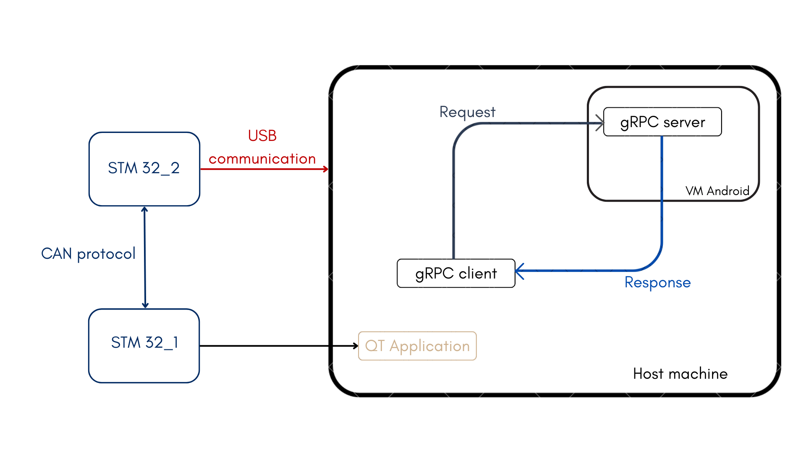
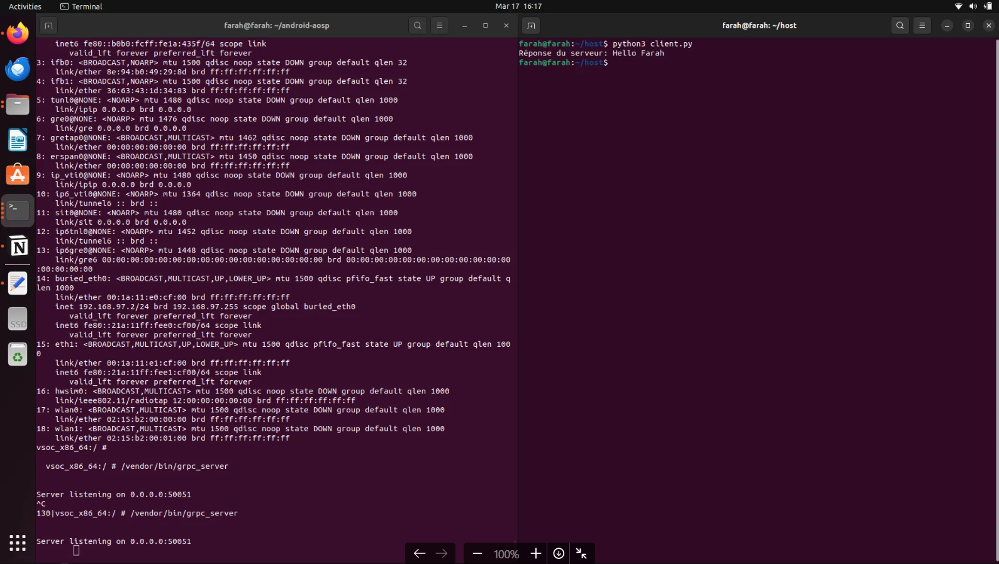
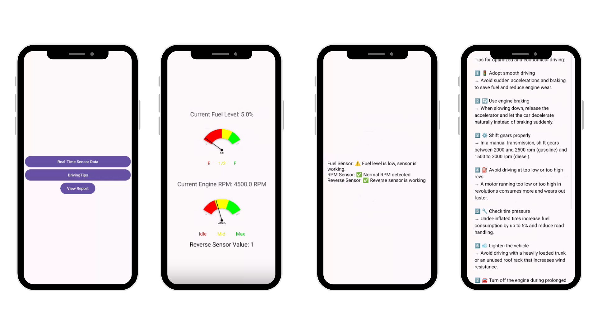
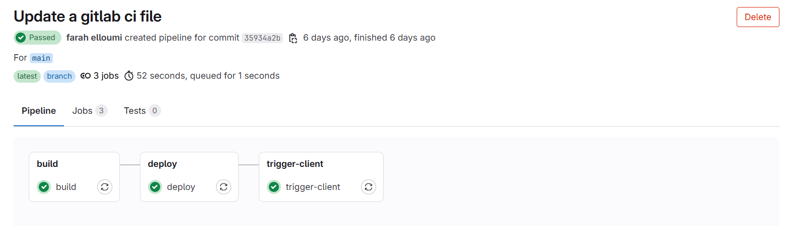
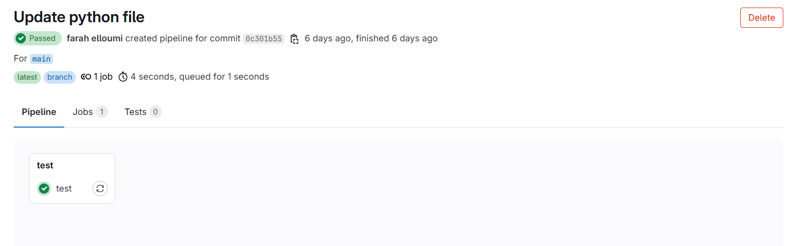
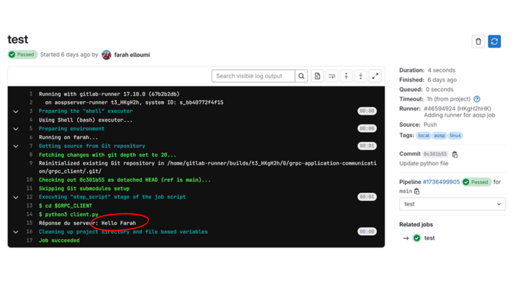
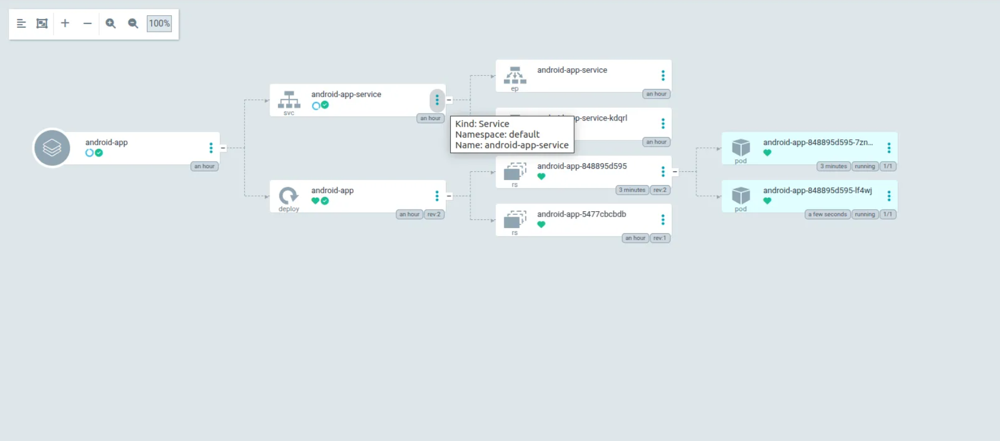

# 🚗 CI/CD Pipeline for Android App : Vehicle Data Tracking for System Analysis and Troubleshooting


## Table of Contents

- [📌 Project Overview](#-project-overview)
- [📁 Directory Structure](#-directory-structure)
- [🏗️ Project Architecture](#%EF%B8%8F-project-architecture)
- [⚙️ Technologies Used](#-llm)
- [🌐 Communication between gRPC server and gRPC client](#-data)
  - [📚 AOSP project](#-data-description)
  - [💻 Run a gRPC Server (C++) in VM Android](#-data-preparation)
  - [🖥️ Run a gRPC Client (Python) on the host machine](#-data-preparation)
- [📱 Android Application in Kotlin ](#-model)
- [🔧 GitLab CI Architecture](#-aws-setup)
- [⚡ Kubernetes Architecture & Deployment](#-aws-setup)
- [🌐 Argo CD Architecture & Deployment](#-aws-setup)
- [📈 Results](#-resultat)
- [🔧 Usage](#-usage)
- [🔮 Future Considerations](#-future-considerations)
- [🤝 Contributing](#-contributing)
- [👨‍💻 Project By](#project-by)

## 📌 Project Overview  

### 📚 Background:

This project, developed by Farah Elloumi and Mohamed Hedi Ben Amor as part of their professional work at Primatec Engineering, focuses on vehicle Data Tracking for system analysis and troubleshooting. Additionally, it utilizes these results to predict the anomalies in the vehicle. The solution is containerized with Docker, automated using GitLab CI and deployed using Kubernetes with Argo CD for continuous deployment.

### 🌟 The project must include:

- **✅ Real-Time Data Processing**:
  - Utilizes gRPC for real-time communication between the Android diagnostic app and the server.
  - Ensures seamless data transmission and processing for vehicle diagnostic data to detect issues and provide insights.

- **📊 Dynamic Visualization**:
  - Builds a real-time dashboard within the app to monitor vehicle health, displaying key metrics such as engine status, fuel efficiency, and error codes.
  - Provides visual representations of system performance, assisting users in decision-making for maintenance or repairs.

- **🛡️ Security and Vulnerability Scanning**: 
  - Ensure code, secrets, and container images are secure by identifying and mitigating vulnerabilities during the CI/CD pipeline.

- **✅ Automated Testing**: 
  - Automatically test all changes to ensure functionality and stability.

- **🐳 Dockerization**: 
  - Build the android application into portable Docker images.

- **☸️ Kubernetes Deployment**: 
  - Deploy services seamlessly across devolepment environments using Kubernetes clusters.

- **🔄 Integration Testing**: 
  - Validate the functionality and reliability of all services after deployment.

- **🚀 Argo CD for Continuous Delivery**:

  - Implement Argo CD to automate the deployment process, ensuring fast and reliable updates across environments.

  - Use Argo CD to manage Kubernetes resources, monitor application health, and rollback to previous versions if necessary for smooth and consistent updates.

- **🛠️ Scalable and Extensible Architecture**:
  - Employs a modular design, separating vehicle data collection, analysis, and visualization components for flexibility and scalability.
  - Allows for the integration of new diagnostic tools and data sources to support future enhancements and additional vehicle types.


## 📁 Directory Structure

```plaintext
project/
│
├── diagnostic-app/
│   ├── Source code for the Kotlin application
│   ├── k8s/
│   ├── ├── deployment.yaml                         # defining a Kubernetes Deploymen
│   ├── ├── service.yaml                            # defining a Service of type LoadBalancer
│   ├── .gitlab-ci.yml                              # GitLab configuration file for the CI/CD pipeline
│   ├── Dockerfile                                  # Docker configuration file for the application
│                   
├── grpc_client/
│   ├── .gitlab-ci.yml                              # GitLab configuration file for the CI/CD pipeline
│   ├── client.py                                   # Python script defining the gRPC client
│   ├── helloworld.proto                            # .proto file defining gRPC services
│      
├── grpc_server/
│   ├── .gitalb-ci.yml                              # GitLab configuration file for the CI/CD pipeline
│   ├── Android.bp                                  # .bp file for the build system
│   ├── aosp_cf.mk                                  # Makefile to add packages with the cc_binary name
│   ├── greeter_server.cc                           # Cpp script defining the gRPC server
│   ├── helloworld.proto                            # .proto file defining gRPC services
│       
└── README.md                                       # Project documentation 
└── manifest.xml                                    # XML code to link three projects within the same GitLab group
```

## 🏗️ Project Architecture

### Global Architecture


🔍 **How it Works:**
1. **Embedded Communication**: Two STM32 microcontrollers communicate using the CAN protocol, enabling data exchange between the embedded components.
2. **USB Data Transmission**: The STM32_2 microcontroller transmits diagnostic data to the host machine via USB communication.
3. **gRPC Client-Server Model**: A gRPC client running on the host machine forwards requests to a gRPC server hosted in an Android Virtual Machine (VM) for processing.
4. **Response Handling**: The gRPC server processes the request and returns a response to the gRPC client, completing the diagnostic workflow.
5. **QT Application Integration**: The architecture allows for integration with a QT-based application for enhanced data visualization and user interaction.

## ⚙️ Technologies Used
| Component            | Technology                          |
|-----------------------|-------------------------------------|
| **Frontend**         | Kotlin                             |
| **Container Management** | Docker                             |
| **CI/CD**   | GitLab CI, ArgoCD (GitOps-based CD)                           |  
| **Orchestration**   | Kubernetes                           |  

## 🌐 Communication between gRPC server and gRPC client
This guide will walk you through the process of setting up the AOSP build environment, compiling a C++ binary (`server.cpp`) to run in an Android VM (Cuttlefish), and establishing communication between a **gRPC client** in host machine and a **gRPC server** in Virtual Machine.
###  📚 AOSP project

#### **Prerequisites**

To successfully set up and run your C++ binary with gRPC on the Android VM, you'll need the following tools and requirements:

- **System Requirements**:
  - **OS**: Ubuntu 20.04+ 
  - **Disk space**: 400 GB+ free
  - **RAM**: 16 GB minimum
  - **Tools**:
    - **Git**
    - **Python**
    - **Repo**
    - **OpenJDK (11 or 17)**

- **Installation & Dependencies**:
  - 1️⃣ **Install Git**:

      ```bash
      sudo apt update
      sudo apt install git -y
      git --version
      ```

  - 2️⃣ **Install Python**:
      ```bash
      sudo apt install python3 python3-pip -y
      python3 --version
      ```

  - 3️⃣ **Install Repo**:
    ```bash
    mkdir -p ~/.bin
    curl https://storage.googleapis.com/git-repo-downloads/repo > ~/.bin/repo
    chmod +x ~/.bin/repo
    echo 'export PATH="$HOME/.bin:$PATH"' >> ~/.bashrc
    source ~/.bashrc
    repo --version
    ```

  - #### 4️⃣ **Install OpenJDK**:
    ```bash
    sudo apt install openjdk-11-jdk -y
    java -version
    ```
  - #### 5️⃣ **Install libraries**:
    ```bash
    sudo apt install clang llvm android-tools-adb android-tools-fastboot -y
    ```

- ⚠️ **Memory Issues**:
If you're using 16GB of RAM, you'll need to add swap memory to avoid compilation issues.
    ```bash
    sudo fallocate -l 16G /swapfile
    sudo chmod 600 /swapfile
    sudo mkswap /swapfile
    sudo swapon /swapfile
    ```

    To make it permanent:
    ```bash
    echo '/swapfile none swap sw 0 0' | sudo tee -a /etc/fstab
    ```
    Check memory usage:
    ```bash
    free -h
    ```
#### **Getting Started**:
1. **Clone AOSP project**:

    We recommend using Android Version 14 GSI for building AOSP. This version provides stability and compatibility with the latest features and enhancements.
    
    - Creates a folder named android-aosp in the home directory and moves into it to prepare the environment for downloading the Android source code.
        ```bash
        mkdir ~/android-aosp
        cd ~/android-aosp
        ```
    - To get the latest version of Repo with its recent bug fixes, You must specify a URL for the manifest , which specifies where the various repositories included in the Android source are placed within your working directory
      ```bash
      repo init -u https://android.googlesource.com/platform/manifest -b android14-gsi
      ```
    - Downloads new changes and updates the working files in your local environment, essentially accomplishing git fetch across all Git repositories. If you run repo sync without arguments, it synchronizes the files for all projects.
        ```bash
        repo sync -j4
        ```
2. **Set up your build environment and Choose a target**
    - From within your working directory, source the envsetup.sh script to set up your build environment 
    ```bash
    source build/envsetup.sh
    ```
    - Before building Android, you must identify a target to build. A target reflects the target platform you are building for. To identify your target to build, use the lunch command followed by a string representing the target.
    ```bash
    lunch aosp_cf_x86_64_phone-trunk_staging-userdebug  # or 'lunch 14'
    ```
    - View the current target
    ```bash
    echo "$TARGET_PRODUCT-$TARGET_BUILD_VARIANT"
    ```
💡 **Fix Common Build Issues**:
**Clang Library Issue**:

If you encounter the error clang.real: error while loading shared libraries: libncurses.so.5, run:
```bash
sudo apt install libncurses5
```
**For Bison Errors**:

Update it:
```bash
sudo apt install bison
bison --version
```

3. **Build the Code**
```bash
make
```

### 💻 Run a gRPC Server (C++) in VM Android

1. **Verify the presence of the aprotoc binary and the protoc version**
    ```bash
    protoc --version
    ```
    The version must be 3.21.0

2. **Generate gRPC and C++ Files**

    In the repo android-aosp/external/grpc-grpc/examples/protos/ directory there are .proto file. You can run the following commands to generate the necessary files:

    ```bash
    aprotoc --grpc_out=. --plugin=protoc-gen-grpc=/home/user/android-aosp/out/host/linux-x86/bin/protoc-gen-grpc-cpp-plugin helloworld.proto
    aprotoc --cpp_out=. helloworld.proto
    ```
    These generated files declare the interfaces for gRPC services and contain the code for serializing and deserializing messages using the protobuf APIs.

3. **Move Generated Files**

    Move the generated files to android-aosp/external/grpc-grpc/examples/cpp/helloworld.

4. **Create android.bp File**

    Create a file named android.bp in android-aosp/external/grpc-grpc/examples/cpp/helloworld with the following content:
    ```bash
    cc_binary {
    name: "grpc_server",
    vendor: true,
    cflags: [
    "-Wno-error",
    "-Wno-unused-parameter",
    "-Wno-implicit-fallthrough",
    "-Wno-unused-result",
    "-g",
    ],
    srcs: [
    "greeter_server.cc",
    "cmake/build/helloworld.grpc.pb.cc",
    "cmake/build/helloworld.pb.cc",
    ],
    include_dirs: [
    "external/grpc-grpc/include",
    "external/protobuf/src",
    "external/grpc-grpc/examples/cpp/helloworld/cmake/build/",
    ],
    shared_libs: [
    "libprotobuf-cpp-full",
    "libgrpc++_unsecure",
    "libz",
    "libc++",
    "libm",
    "libdl",
    ],
    }
    ```
    This file is used in the Android build system based on Soong, which replaces the traditional Makefile-based build system. The main purpose of this file is to define the modules and their properties for building components in the Android project.

5. **Modify AOSP Makefile**

    In android-aosp/device/google/cuttlefish/vsoc_x86_64/phone/aosp_cf.mk, add:
    ```bash
    PRODUCT_PACKAGES += \
      grpc_server
    ```
6. **Build the Project**

    Run the following command to build the project:
    ```bash
    make
    ```

7. **Run the Android VM (Cuttlefish)**
  
    Create the Android VM instance:
    ```bash
    acloud create --local-instance 1 --local-image
    ```
8. **Access ADB Shell**
    ```bash
    adb root
    adb shell
    ```
9. **Verify the Binary**

    Check if the binary exists:
    ```bash
    ls /vendor/bin/grpc_server
    ```
10. **Run the gRPC Server**

    Run the server:
    ```bash
    /vendor/bin/grpc_server
    ```
11. **Check the Server is Listening**
    
    **Expected output**:
    ```bash
    Server listening on 0.0.0.0:50051
    ```

### 🖥️ Run a gRPC Client (Python) on the host machine
1. **Install Python Dependencies**

    Install the necessary Python dependencies:
    ```bash
    pip3 install grpcio grpcio-tools
    ```
2. **Client Code (client.py)**

    Create the client.py file with the following code:
    ```bash
    import grpc
    import helloworld_pb2
    import helloworld_pb2_grpc

    def run():
        with grpc.insecure_channel("your_vm_ip:50051") as channel:
            stub = helloworld_pb2_grpc.GreeterStub(channel)
            response = stub.SayHello(helloworld_pb2.HelloRequest(name="Farah"))
            print("Server response:", response.message)

    if __name__ == "__main__":
        run()
    ```
3. **Generate Python Code from .proto File**

    Run the following command to generate the Python files from the .proto file:
    ```bash
    python -m grpc_tools.protoc -I./ --python_out=./ --grpc_python_out=./ helloworld.proto
    ```
4. **Run the Python Client**

    Run the client with the following command:
    ```bash
    python3 client.py
    ```
5. **Expected Output**
    ```bash
    Server response: Hello Farah
    ```


## 📱 Android Application in Kotlin
My Android diagnostic application, developed in Kotlin, provides real-time insights into vehicle performance. It features a user-friendly interface that displays essential metrics such as current fuel level and engine RPM, helping users monitor their vehicle’s condition effortlessly. Additionally, the app offers driving tips based on the collected data, enabling a more efficient and optimized driving experience. 

## 🔧 GitLab CI Architecture 
### Manifest file:
To streamline development and deployment, I structured my **GitLab CI architecture** around a **GitLab group** named **`grpc-application-communication`**. This group contains three distinct projects:  

- **`grpc-server`**: Handles server-side communication.  
- **`grpc-client`**: Manages client-side interactions.  
- **`diagnostic-application`**: The Android application providing vehicle diagnostics.  

To ensure consistency and simplify management, I created these three projects within the group **using a `manifest.xml` file**. This approach allows for efficient synchronization and centralized control over all components of the system.

**Steps:**

To import the AOSP project into GitLab group, follow these steps:
1. From your GitLab dashboard, select *New project*.
2. Switch to the Import project tab.
3. Choose Manifest file as the import method.
4. Provide GitLab with the manifest XML file for the project.
5. Select the group you want to import the project to (ensure you have created a group beforehand if needed).
6. Click *List available repositories*. This will redirect you to the import status page with a list of projects based on the manifest file.
7. To import the projects:
   - For importing all projects for the first time: *Select Import all repositories*.
   - For *re-importing individual projects*: Select *Re-import*, specify a new name, and click *Re-import* again. Re-importing will create a new copy of the source project.

### GitLab runner:
This project utilizes a GitLab Runner to manage and execute CI/CD pipelines. Given that the AOSP project is quite large (around 400GB), the GitLab Runner is configured to access the project on the host machine directly. This allows for efficient handling of the build and testing processes without the need to duplicate the entire project on the runner itself, ensuring faster and more resource-efficient operations.

**Steps:**

Follow these steps to install and register a GitLab Runner:

1. **Install GitLab Runner on the host:**
    - Download the GitLab Runner binary:
      ```bash
      sudo curl -L --output /usr/local/bin/gitlab-runner https://gitlab-runner-downloads.s3.amazonaws.com/latest/binaries/gitlab-runner-linux-amd64
      ```
    - Make it executable:
      ```bash
      sudo chmod +x /usr/local/bin/gitlab-runner
      ```
    - Create a `gitlab-runner` user:
      ```bash
      sudo useradd --comment 'GitLab Runner' --create-home gitlab-runner --shell /bin/bash
      ```
    - Install GitLab Runner:
      ```bash
      sudo gitlab-runner install --user=gitlab-runner --working-directory=/home/gitlab-runner
      ```
    - Start the GitLab Runner:
      ```bash
      sudo gitlab-runner start
      ```
    - Verify the installation:
      ```bash
      gitlab-runner --version
      ```

2. **Register the GitLab Runner:**
    - Before registering, disable the **Enable instance runners for this project** option in your GitLab project:
      - Go to **Settings > CI/CD > Runners**.
      - Disable **Enable instance runners for this project**.
    - Click **New project Runner**, and provide the necessary details, including **name**, **tags**, and other required information.
    - After this, you can proceed with the registration using the **URL**, **token**, **name**, and **tags** provided by GitLab.

      ```bash
      gitlab-runner register
      ```
## ⚡ Kubernetes Architecture & Deployment
The Kubernetes architecture for the diagnostic application facilitates scalable, secure, and automated deployment of application services.

### Goals

**Service Management:** Efficiently manage the Android application service using Kubernetes resources such as:

- **Deployments:** Ensure high availability and scalability of application pods for the Android app.
- **Services:** Expose the Android app pods to external traffic through a LoadBalancer service, while enabling internal communication between pods within the cluster.

**Stability and Recovery:**

- **Rollback functionality** ensures stability by allowing you to revert to a previous deployment if there are any issues.
- This functionality helps minimize downtime and ensures the reliability of the application for users.

### Kubernetes Components

The deployment uses the following Kubernetes components:

- **Deployments:** Manage the Android app’s application pods using Docker images pushed to DockerHub. Ensure high availability and scalability with configurable replicas, as specified in `deployment.yaml`.
- **Services:** Expose the Android app using a **LoadBalancer** service to handle external traffic, and facilitate internal communication between the pods within the cluster. 

## 🌐 Argo CD Architecture & Deployment

**Argo CD** is a declarative, GitOps continuous delivery tool for Kubernetes that enables the automated deployment of applications. It follows the GitOps principle, where the Git repository is the source of truth for both the application configuration and deployment process. Argo CD simplifies application management by synchronizing Kubernetes resources with the desired state defined in the Git repository.

The architecture of Argo CD consists of several key components:

- **Argo CD Server:** The central component that serves the web UI, CLI, and API, allowing users to interact with the system, manage applications, and monitor the deployment process.
- **Controller:** The core component that monitors the Git repository for changes and ensures the state of the Kubernetes resources matches the configurations in the repository.
- **Repositories:** Argo CD connects to Git repositories (such as GitHub or GitLab) where Kubernetes YAML files, Helm charts, and Kustomize configurations are stored. These repositories define the desired state of the application and can be managed across multiple environments.

**Deployment with Argo CD** for your Android app involves the following steps:

1. **Set Up a Kubernetes Cluster**
    For local testing, install **Minikube**:

    ```bash
    # Install Minikube (if not installed)
    curl -LO <https://storage.googleapis.com/minikube/releases/latest/minikube-linux-amd64>
    sudo install minikube-linux-amd64 /usr/local/bin/minikube

    # Start Minikube
    minikube start

    # Verify that Kubernetes is running
    kubectl get nodes
    ```
2. **Install Argo CD**
    - **Install Argo CD in the Kubernetes Cluster**

        ```bash
        kubectl create namespace argocd
        kubectl apply -n argocd -f <https://raw.githubusercontent.com/argoproj/argo-cd/stable/manifests/install.yaml>
        ```

    - **Check Argo CD Pods**

      ```bash
      kubectl get pods -n argocd
      ```

    - **Expose Argo CD UI**

      ```bash
      kubectl port-forward svc/argocd-server -n argocd 8080:443
      ```

      Now, open **`https://localhost:8080`** in your browser.
    - **Get Argo CD Admin Password**

      ```bash
      kubectl -n argocd get secret argocd-initial-admin-secret -o jsonpath="{.data.password}" | base64 -d
      ```

      Use **username: `admin`** and the decoded password to log in.
3. **Deploy the App with Argo CD**
    - **Add Your GitLab Repo to Argo CD**

      ```bash
      argocd repo add <https://gitlab.com/YOUR_GITLAB_USERNAME/YOUR_REPO.git> --username YOUR_GITLAB_USERNAME --password YOUR_GITLAB_PASSWORD
      ```

    - **Create an Argo CD Application**

      ```bash
      argocd app create android-app \\
        --repo <https://gitlab.com/YOUR_GITLAB_USERNAME/YOUR_REPO.git> \\
        --path k8s \\
        --dest-server <https://kubernetes.default.svc> \\
        --dest-namespace default
      ```

    - **Sync the Application**

      ```bash
      argocd app sync android-app
      ```
4. **Access the Deployed App**

    - **Get the Service External IP**

      ```bash
      kubectl get svc android-app-service
      ```

      The **EXTERNAL-IP** column will show the app's IP. Open it in your browser.

5. **Verify Deployment**
      ```bash
      kubectl get pods
      kubectl logs -f deployment/android-app
      ```
## 📈 Results
### Diagnostic Application


### CI/CD pipelines



### ArgoCD pipeline


## 🔧 Usage
**Prerequisites**
- GitLab Account: Free plan is sufficient.
- Cloud Provider: A cloud provider offering managed Kubernetes services (Azure Kubernetes Service is used here, leveraging the $100 credit for students enrolled in a university).

**Steps to Run**
1. Clone the Repository

    ```bash
    git clone https://github.com/faraheloumi/AOSP-gRPC-DiagnosticApplication-Kotlin-Docker-GitLabCI-Kubernetes-ArgoCD.git

    cd AOSP-gRPC-DiagnosticApplication-Kotlin-Docker-GitLabCI-Kubernetes-ArgoCD
    ```
2. Set Up a GitLab Project
- Create a new project in GitLab.

- Add your GitLab runner with the necessary tags.

- Add the GitLab CI/CD variables:
  
  - Go to Settings → CI/CD → Variables → Add variables:
  - Uncheck the options in the Flags field

| **Key**           | **Value**              | **Visibility** |
|------------------|----------------------------|--------------|
| DOCKER_USERNAME  | `<your_dockerhub_username>` | Visible      |
| DOCKER_PASSWORD  | `<your_dockerhub_password>` | Masked       |

## 🔮 Future Considerations
1. Enhancement of the mobile application to improve performance and user experience.  
2. Continuous development of new features to expand functionality and usability.  
3. Optimization of the CI/CD pipeline for faster and more efficient deployments.  
4. Exploration of additional integrations to enhance scalability and security.  

## 🤝 Contributing
We welcome contributions to enhance this project! Here's how you can get involved:

1. Fork the repository.
2. Create a new branch for your feature or bug fix.
3. Commit your changes.
4. Open a pull request with a detailed description.

## 👨‍💻 Project By
<a href="https://github.com/faraheloumi/AOSP-gRPC-DiagnosticApplication-Kotlin-Docker-GitLabCI-Kubernetes-ArgoCD.git/graphs/contributors">
    
</a>